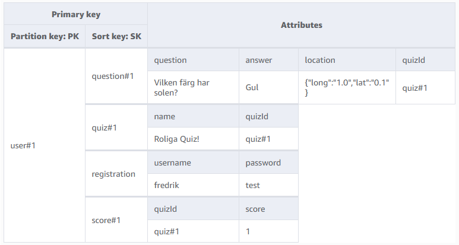

## Quiztopia

### Endpoints

| Name                        | Method | Path                        |
| --------------------------- | ------ | --------------------------- |
| Get leaderboard             | GET    | /api/leaderboard            |
| Submit score to leaderboard | POST   | /api/leaderboard            |
| Get quiz                    | GET    | /api/quiz/{quizId}          |
| Get all quizes              | GET    | /api/quiz/                  |
| Create quiz                 | POST   | /api/quiz/                  |
| Add question to quiz        | POST   | /api/quiz/{quizId}/question |
| Delete quiz                 | DELETE | /api/quiz/{quizId}          |
| Login with user             | POST   | /api/user/login             |
| Register user               | POST   | /api/user/register          |

### Data model

